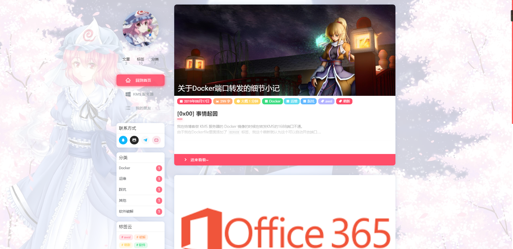

Language: <a title="English" href="https://github.com/SaigyoujiYuyuko233/Saigyou_Ayakashi-HexoTheme/blob/master/README/english.md">English</a> | Chinese 

   

<h1 align="center"><a href="https://blog.uuzdream.cn/" target="_blank">Saigyou-Ayakashi [西行妖]</a></h1>

> 根据 nexmoe/hexo-theme-nexmoe 修改的东方Project主题

## 演示
- [幽幽子の厨房](https://blog.uuzdream.cn/)  
欢迎将你的网站提交到这里来

## 国际化

支持多语言，默认语言为简体中文。
目前中文翻译较全，其他语言翻译不完全，有余力的大佬可以来贡献一下
语言文件在 languages 里，参考 `zh-CN.yml` 进行翻译即可

> 非常欢迎你帮助我们将 Saigyou-Ayakashi 翻译至其他语言！

## 许可证

根据 Apache License 2.0 许可证开源。  
Fork from nexmoe/hexo-theme-nexmoe
